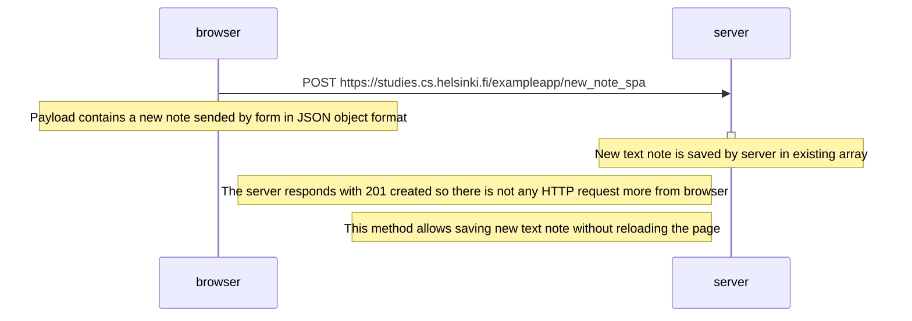

# PARTE 0 - EJERCICIO 6
Realizar un diagrama para el ejemplo del envío de una nueva nota mediante la aplicación de una sola página

```mermaid

sequenceDiagram
    participant browser
    participant server

    browser->>server: POST https://studies.cs.helsinki.fi/exampleapp/new_note_spa
    Note over browser: Payload contains a new note sended by form in JSON object format
    activate server
    Note over server: New text note is saved by server in existing array
    deactivate server

    Note left of server: The server responds with 201 created so there is not any HTTP request more from browser
    Note left of server: This method allows saving new text note without reloading the page

```